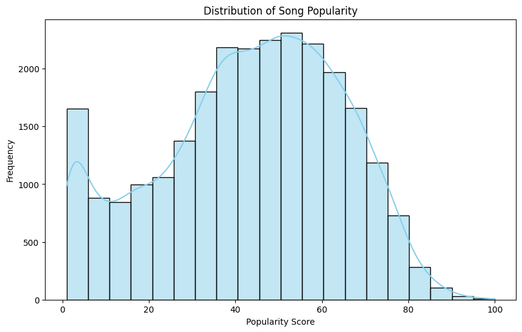
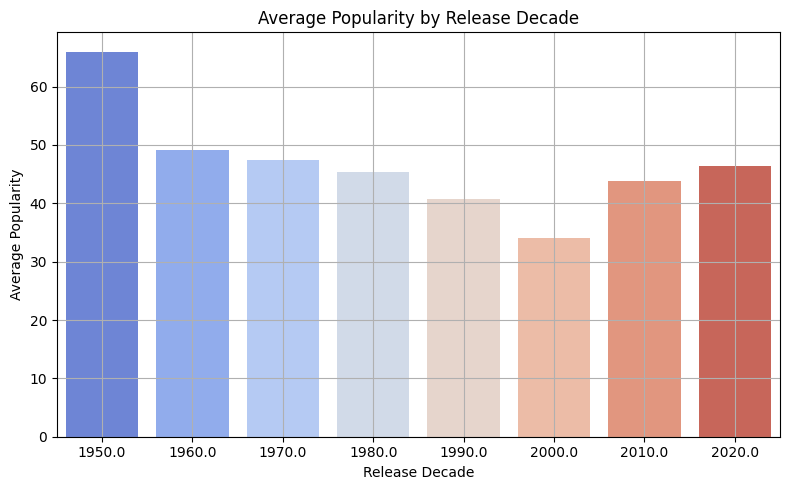
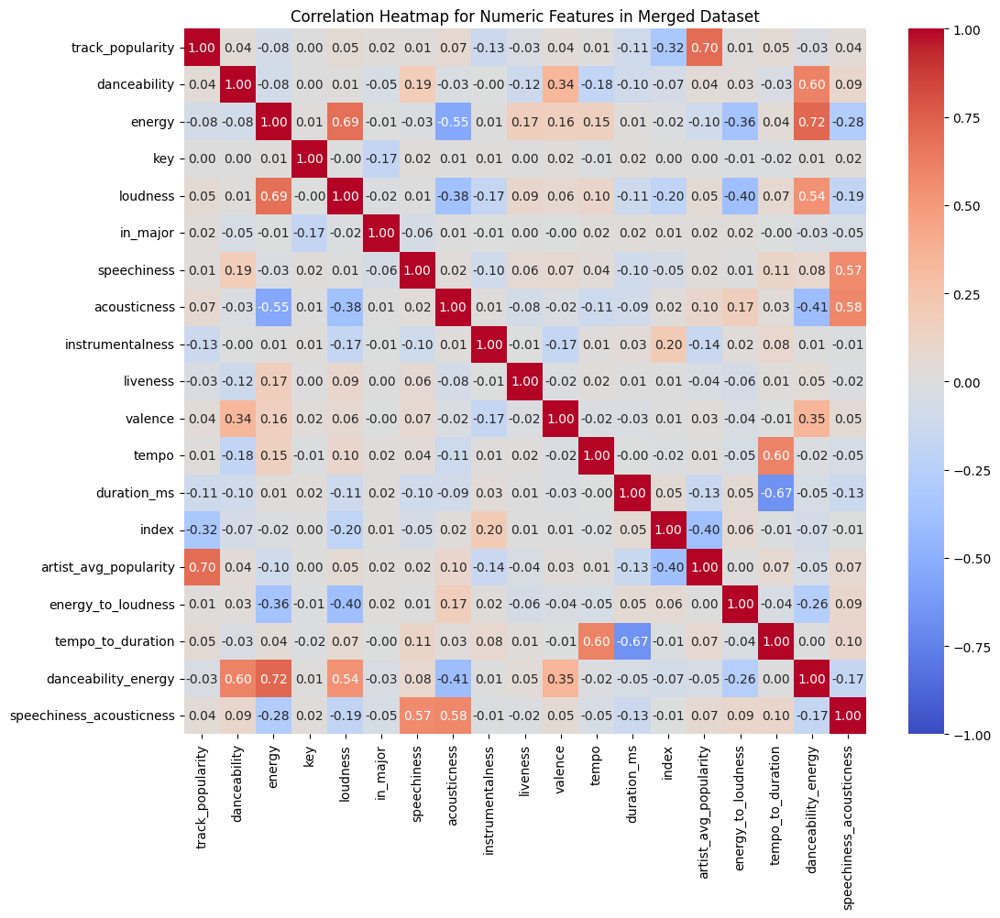
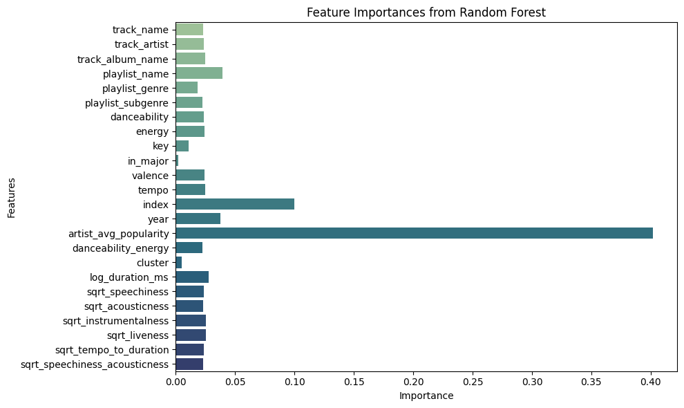

# Spotify Song Popularity Prediction Engine

## 1. Project Overview
This project aims to predict a song’s popularity on Spotify using a variety of audio and metadata features, such as tempo, danceability, energy, and release year. The dataset includes over 16,000 tracks and is used to develop a regression model that estimates a song’s popularity score (0 to 100). The project applies machine learning techniques (linear regression, decision trees, and random forests), data visualization, and feature engineering using Python in Jupyter Notebook.

## 2. Goals and Objectives
- **Primary Goal**: Build a predictive model to estimate the popularity of a song using Spotify audio features.
- **Secondary Goal**: Understand which features contribute most strongly to popularity.
- **Tertiary Goal**: Explore how popularity varies across years and genres using visualizations.

## 3. Data Sources and Features
**Source**: Kaggle dataset with 16,091 songs (1921–2020) pulled from the Spotify API  
**Preprocessing**: Removed duplicate songs and records missing popularity or core audio features.

**Key Features**:
- `popularity` (target)
- `danceability`, `energy`, `valence`, `tempo`, `loudness`, `acousticness`, `instrumentalness`, `speechiness`, `duration_ms`
- `explicit`, `year`

Engineered features:
- `decade` (from `year`)
- log-transformed `duration_ms`
- binary `is_explicit` indicator

## 4. Data Cleaning and Engineering
- Removed duplicates and entries with missing values
- Converted `year` to `decade` for historical trend analysis
- Normalized duration using log transformation to reduce skew
- Dropped outliers in duration, tempo, and loudness for stability
- Converted `explicit` to binary for model input

## 5. Modeling and Evaluation
### Model Specifications:
- **Linear Regression**  
  Baseline model to examine linear feature importance  
  R² Score: 0.31

- **Decision Tree Regressor**  
  Captures non-linear splits in feature space  
  R² Score: 0.55

- **Random Forest Regressor**  
  Best-performing model with bagging and feature selection  
  R² Score: 0.63

### Evaluation Metrics:
- **R² (Coefficient of Determination)**
- **MAE (Mean Absolute Error)**
- **RMSE (Root Mean Squared Error)**

The Random Forest model was selected as the final engine for predicting song popularity due to its superior accuracy and generalization on the test set.

## 6. Key Visualizations
- Popularity Distribution  
  

- Popularity by Release Decade  
  

- Feature Correlation Heatmap  
  

- Feature Importances from Random Forest  
  

---

## 7. Key Findings and Stakeholder Takeaways

- **Popularity Trends Favor Recent Decades**  
  Songs released after 2010 tend to have higher popularity scores, likely due to recency bias in user behavior and Spotify’s algorithmic promotion.

- **Danceability and Energy Are Strong Predictors**  
  Tracks with higher danceability and energy scores are more likely to be popular, supporting the intuition that rhythmic, energetic songs perform better on streaming platforms.

- **Acoustic and Instrumental Tracks Are Less Popular**  
  Features like `acousticness` and `instrumentalness` show a negative relationship with popularity, possibly due to the dominance of vocal-driven pop and hip-hop genres.

- **Explicit Content Shows Slight Popularity Boost**  
  Explicit songs have marginally higher average popularity, possibly reflecting modern lyrical trends and audience targeting.

- **Random Forest Model Identifies Key Drivers**  
  The most predictive features include `energy`, `danceability`, `valence`, and `tempo`, which shape the sonic profile of high-performing songs.

---

## 8. Actionable Recommendations

- **Target High-Energy and Danceable Tracks**  
  Artists and producers aiming for viral success should prioritize rhythmic, energetic production styles.

- **Strategically Time Releases**  
  Release timing matters—consider publishing during recent decades and aligning with listening trends of the moment to maximize algorithmic discovery.

- **Use Audio Features for A/B Testing**  
  Use the model predictions and key feature thresholds to test different versions of a track and forecast performance.

- **Monitor Emerging Feature Combinations**  
  Popularity may shift with evolving tastes; platforms should use models like this to detect new clusters of high-performing attributes in real time.

- **Refine Playlists and Recommendations**  
  Spotify and curators can use feature-based predictions to automate playlist creation and predict potential sleeper hits from new releases.

---

## 9. Challenges and Limitations

- **Popularity Is Time-Sensitive**  
  Scores may reflect transient trends or viral spikes, not inherent song quality.

- **Genre and Language Missing**  
  The dataset does not include genre tags or lyrics, limiting cultural and stylistic interpretability.

- **Potential Algorithmic Feedback Loops**  
  Spotify's own ranking and recommendation system may influence popularity, making the variable partially endogenous.

- **Bias Toward Western/English-Language Songs**  
  The dataset overrepresents tracks popular in Western markets, possibly limiting generalizability.

---

## 10. Future Directions

- Incorporate **genre, lyrics, and sentiment** for deeper insight
- Add **playlist placements** or **algorithm exposure** as control variables
- Explore **classification (hit vs. non-hit)** instead of continuous popularity
- Apply **unsupervised learning** (e.g., clustering) to discover archetypes of popular songs
- Extend to **real-time streaming prediction** using time-series Spotify API data
